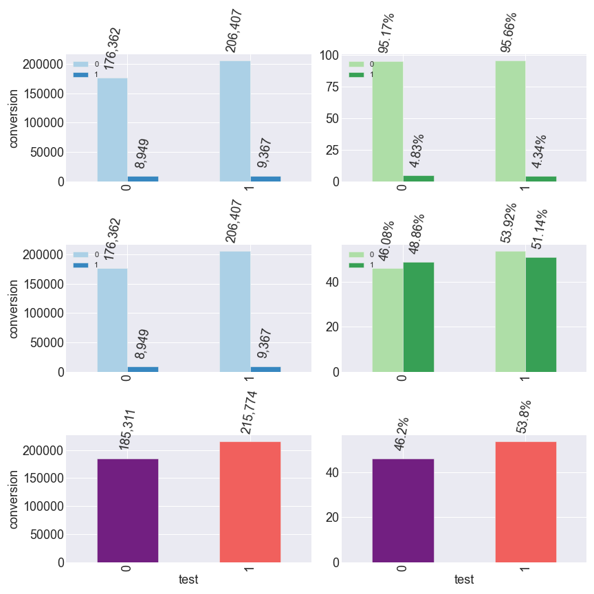
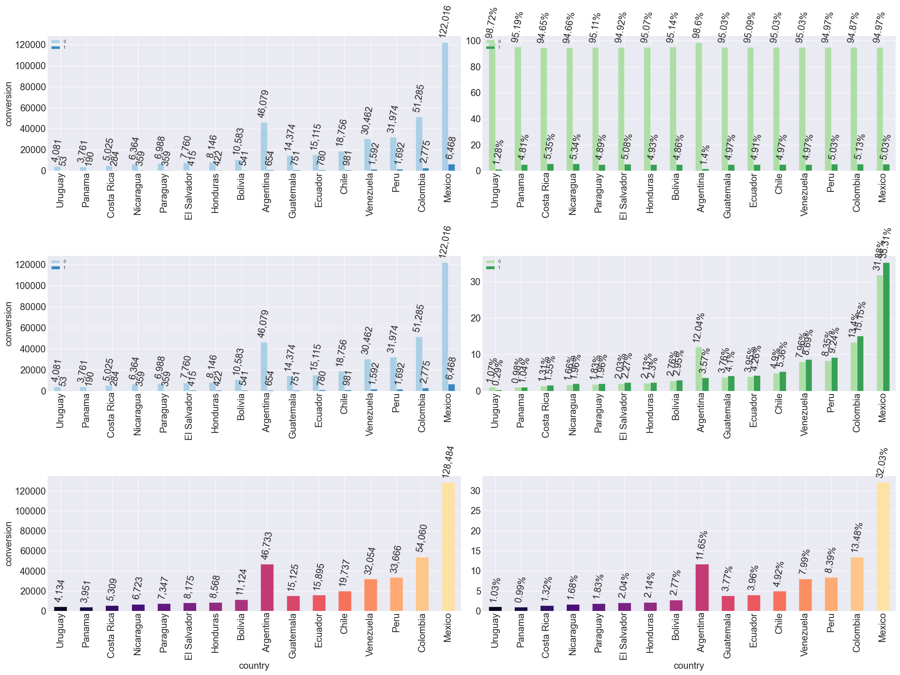
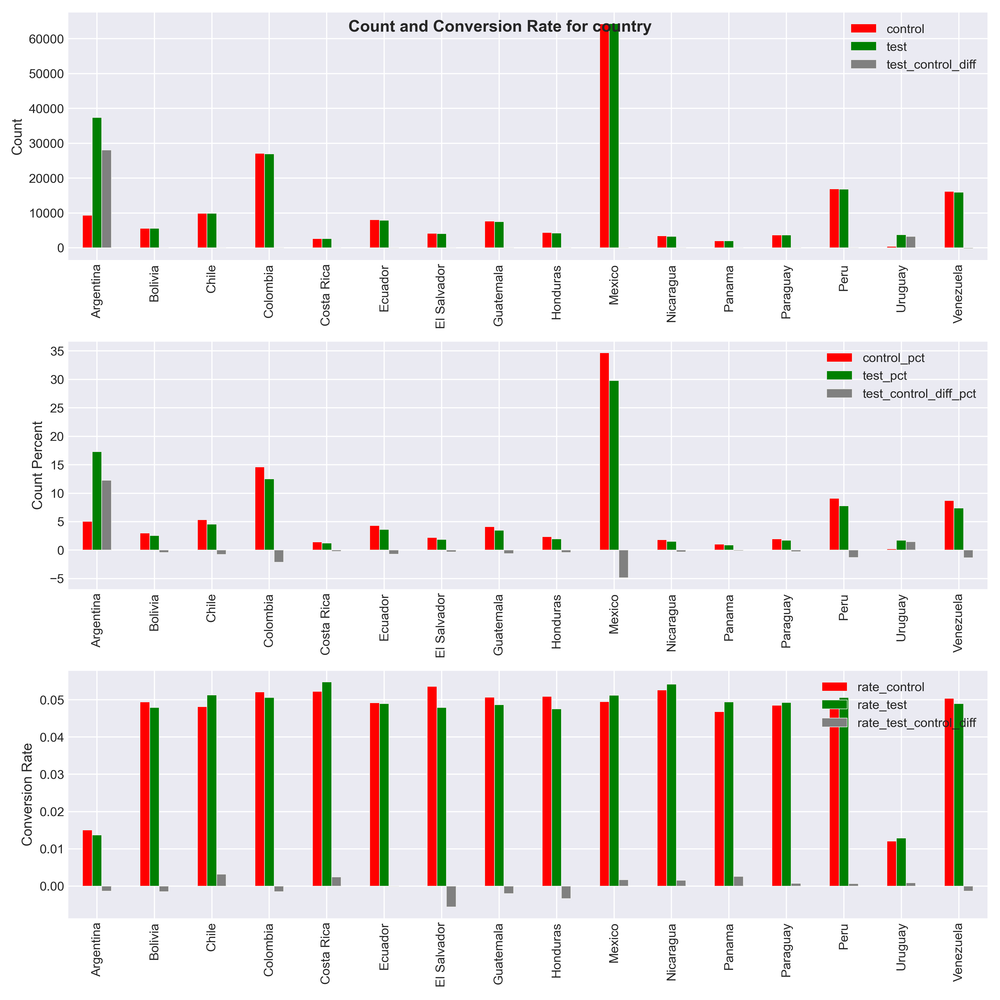
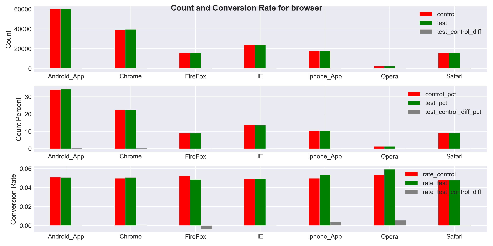

# Problem
An e-commerce website is testing A/B test such that if Spanish translation
is done by each country's local person instead of only one Spanish person,
then the sales may increase. There is data of 5 days and we have to determine
the success or failure of the test.

# Solution
- Spain only has the test data and no control data, so It should be excluded from the analysis.
- The Argentina and Uruguay have very different test and control sizes.
  They must be excluded from the analysis.
- We should check for data sanity: missing data, duplicated ids, date column might have bad format and so on.

# Results
- We have only 5 days of data. The power test shows that we need about 10,702,928 data for each group (test and control). So we must conduct the A/B test for few more
months to obtain more data.
- If we only analyze the given data, we see little bit improvement in later days. (Dec2 and Dec4 with Dec3 have little bit fluctuation).
- We should wait for about 5 months and perform the analysis. Then, again we can
test our analysis after another few months that whether the new changes actually
contribute to the revenue gain or not.
- We can do the statistical analysis for each Country and see how it performs
for each countries, rather than overall data.

# EDA

